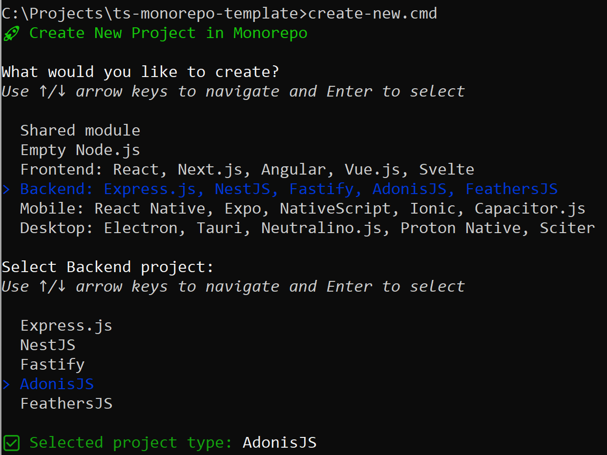

# TypeScript Monorepo Template

A comprehensive template for managing multiple TypeScript projects within a single repository.

## What is a Monorepo?

A monorepo (monolithic repository) is a software development strategy where code for multiple projects is stored in the same repository, enabling easy code sharing, simplified dependency management, atomic changes across packages, coordinated versioning, unified CI/CD pipelines, and improved developer experience with better visibility into the entire ecosystem — all while maintaining centralized configuration, shared tooling, and consistent standards.

## Common Challenges with TypeScript Monorepos

TypeScript monorepos face significant setup challenges: cross-package type sharing, project references configuration, efficient incremental builds, consistent path aliases, proper build order orchestration, and maintaining IDE intellisense across workspace boundaries while keeping build performance acceptable as the codebase grows.

## Why This Monorepo Template?

This TypeScript monorepo template provides an opinionated yet flexible foundation with several key advantages:

- **Lightweight & Minimal Dependencies** - Built with simplicity in mind using native workspaces without heavy external orchestration tools, resulting in faster installations and reduced dependency maintenance
- **Project Scaffolding** - Interactive CLI tool for creating new projects/modules with proper configuration
- **Multi-Framework Support** - Ready-to-use templates for popular frameworks (React, Vue, Angular, Express, NestJS, React Native, Electron, etc.)
- **Shared Module System** - Automatic symlink creation to shared modules with proper TypeScript path resolution
- **VS Code Integration** - Pre-configured debugging, tasks, and settings optimized for monorepo development
- **Atomicity** - Each workspace project builds independently, allowing for isolated debugging, testing, and deployment while still enabling cross-package imports when needed - perfect balance of independence and integration

## Getting Started

To create your own monorepo based on this template, follow these steps:

1. **Obtain the template**. You can download the source code as a [ZIP archive from GitHub](https://github.com/d-mozulyov/ts-monorepo-template/archive/refs/heads/main.zip) or clone the repository and remove the `.git` folder:
   ```bash
   git clone https://github.com/d-mozulyov/ts-monorepo-template.git my-monorepo
   cd my-monorepo
   rmdir /s /q .git    # Windows
   rm -rf .git         # Linux/macOS/Bash
   ```
2. **Initialize Git repository**. This monorepo structure doesn't impose any restrictions on repository usage, so you're free to either use it without creating a repository or **copy these files into your existing one** and add them with the console command `git add .`. If you'd prefer to create a new repository, you can do so like this:
   ```bash
   git init
   git add .
   git commit -m "Add TypeScript monorepo structure
   git remote add origin url/to/your/repository.git
   git push origin main
   ```
3. **Setup dependencies**. Instead of using standard `npm install`, run the universal setup script:
   ```bash
   setup.cmd         # Windows
   sh ./setup.cmd    # Linux/macOS/Bash
   ```
   For more details on how this works and why it's important, see the _"Shared Modules and Atomic Build Architecture"_ section below.
   
4. **Build the app example project**. This monorepo features a comprehensive set of standard scripts (detailed in the _"Standard Package Scripts_" section below). You can build only the App application or all monorepo applications with a single command:
   ```bash
   npm run build       # Build all applications
   npm run build:app   # Build App application
   ```
5. **Run the app example project**.
   ```bash
   # Start the app project
   npm run start:app
   
   # You should see the following output in the console:
   Hello from the App!
   2 + 3 = 5
   ```

## Standard Package Scripts

Each `package.json` contains a `scripts` section that can be manually configured and executed from the command line. Each script has a name (like `build`, `test`, `start`, etc.) which is used to execute it. For example, the same script named `build` can be run using different package managers:
```bash
npm run build | yarn build | pnpm build
```
The monorepo template does not impose any restrictions on this section beyond the existing syntax rules. However, when generating a new project within this monorepo, for your convenience, we pre-populate a set of typical scripts that you can run right away: some are described in the root directory, some in the project directory.

For example, if you are in the project directory `packages/app`, you can run the following:
```
npm run clean  - Removes build artifacts
npm run lint   - Runs ESLint
npm run test   - Runs tests
npm run build  - Compiles TypeScript to JavaScript
npm run start  - Runs the compiled project
```
When in the root directory of the monorepo, you can run scripts affecting all projects or target specific projects with namespaced commands:
```
npm run clean  - Removes build artifacts from all projects
npm run lint   - Runs ESLint on all projects
npm run test   - Runs tests for all projects
npm run build  - Compiles TypeScript to JavaScript for all projects

npm run clean:app    - Removes build artifacts from app project
npm run lint:app     - Runs ESLint on app project
npm run test:app     - Runs tests for app project
npm run build:app    - Compiles TypeScript to JavaScript for app project
npm run start:app    - Runs the compiled app project

npm run build:telegram-bot  - Builds only the telegram-bot project
npm run start:backend       - Starts only the backend project
```
Following the same pattern, you can work with any workspace project in the monorepo. Each new project created with `create-new.cmd` automatically registers these standardized scripts in the root package.json.

## VS Code Integration

The monorepo includes pre-configured VS Code settings that enhance development:
- **Tasks** - All standard package scripts are available as VS Code tasks in `tasks.json`:
  ```
  Clean, Lint, Test, Build                                # all applications
  Clean App, Lint App, Test App, Build App, Start App     # specific application (App)
  ```
- **Debugging** - Each project has its own debug configuration in `launch.json`:
  ```
  Debug App
  ```
- **Editor Settings** - TypeScript-optimized configuration with formatOnSave and ESLint integration in `settings.json`

When you create a new project using `create-new.cmd`, corresponding VS Code tasks and debug configurations are automatically added to these files. This ensures a consistent development experience and allows you to run, debug, and maintain all projects directly from VS Code's interface.

## Shared Modules and Atomic Build Architecture

There are multiple ways to organize access to a `shared` directory in a monorepo. We suggest you consider creating a symbolic link called `src/@shared` pointing to this directory. This approach differs from the traditional method of importing shared code as a package, offering advantages like flexible module hierarchy, tree-shaking optimizations, and direct source access for easier debugging. In the App application example, the `add()` function is imported from `@shared` symlink. This approach allows importing directly from a specific directory or module for better optimization and readability, which is practically impossible when importing from a packaged dependency:
```typescript
import { add } from './@shared' /* or './@shared/utils' or './@shared/utils/math' */;

console.log('Hello from the App!');
console.log(`2 + 3 = ${add(2, 3)}`);
```
Our template doesn't restrict you in any way. You're free to create symlinks manually or not use them at all, use any package manager of your choice, delete the _node_modules_ folder and reinitialize it. The goal is to make your life easier when solving common tasks.

For dependency initialization, both locally or on a build server, instead of the usual `npm/yarn/pnpm install`, we recommend using the universal `setup.cmd` script (Windows: run it directly, Linux/macOS: run with `sh ./setup.cmd`). This script initializes symlinks, downloads development dependencies to the _node_modules_ in the root directory, and places compact **production** dependencies in the project directory's _node_modules_. This approach isolates projects from each other, making builds faster and consuming less disk space.

The `setup.cmd` script allows you to explicitly specify which package manager to use: `--npm` (default), `--yarn`, or `--pnpm`. **Note:** On Windows, creating symlinks may require administrator privileges.

## Multi-Framework Support

The monorepo architecture doesn't limit what frameworks you can add, but with the built-in `create-new.cmd` script, you can easily initialize a wide variety of project types:

- Shared module
- Empty Node.js
- Frontend: React, Next.js, Angular, Vue.js, Svelte
- Backend: Express.js, NestJS, Fastify, AdonisJS, FeathersJS
- Mobile: React Native, Expo, NativeScript, Ionic, Capacitor.js
- Desktop: Electron, Tauri, Neutralino.js, Proton Native, Sciter



Run it on Windows with `create-new.cmd` or on Linux/macOS with `sh ./create-new.cmd`. Each framework comes with properly configured TypeScript, build scripts, and shared module integration. The script `create-new.cmd`, as well as `setup.cmd`, allows you to explicitly specify which package manager to use: `--npm` (default), `--yarn`, or `--pnpm`. **Note**: On Windows, creating symlinks may require administrator privileges.

## Contributing

This TypeScript monorepo template is an open project, and contributions are welcome! If you find it useful, consider:

- ⭐ Star the repository
- 🐛 Creating issues for bugs you find
- 🔧 Submitting PRs to improve functionality
- 📚 Enhancing documentation
- 🚀 Sharing your experience using it

If you're using this template for your own projects, I'd love to hear about your use case and any customizations you've made. For major changes or new framework additions, please open an issue first to discuss what you'd like to change.

## License

This project is licensed under the MIT License - see the [LICENSE](./LICENSE) file for details.
